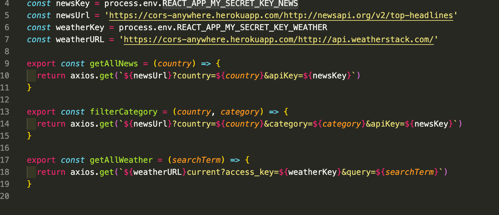
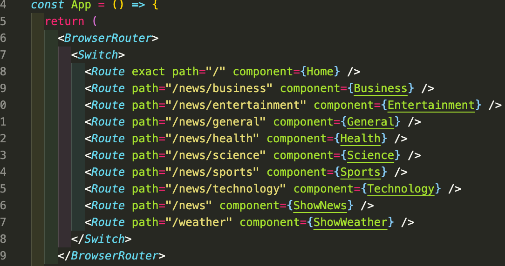
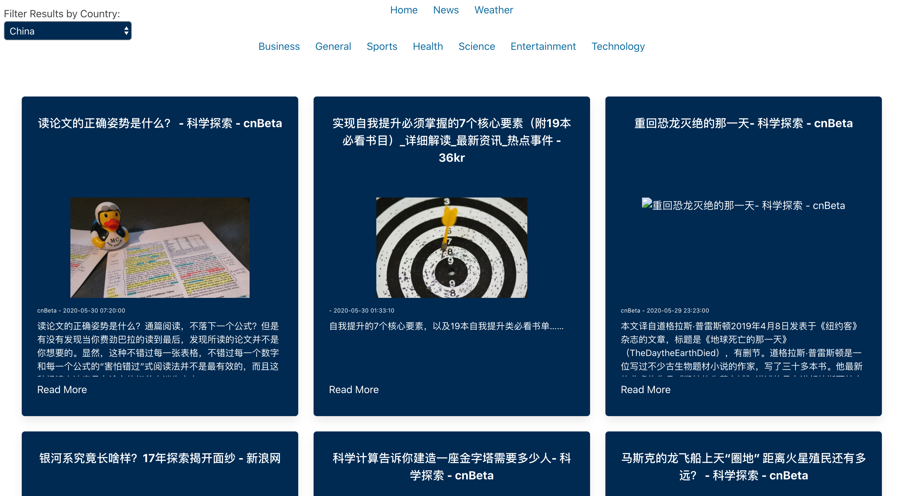
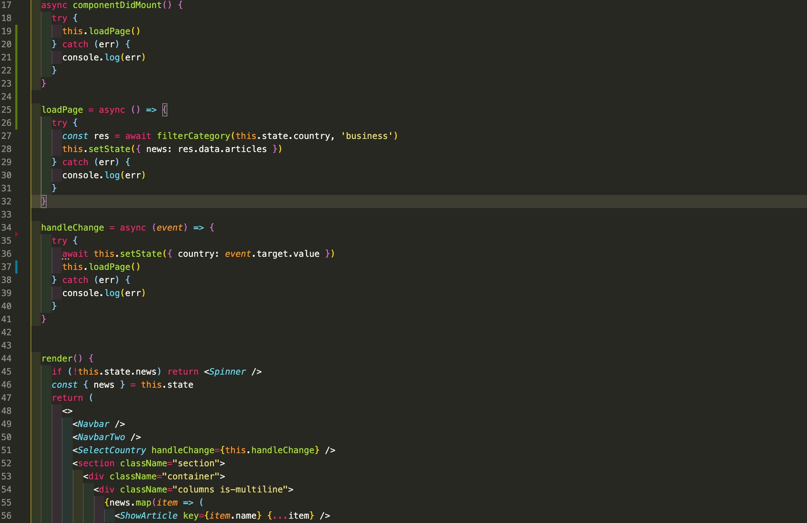
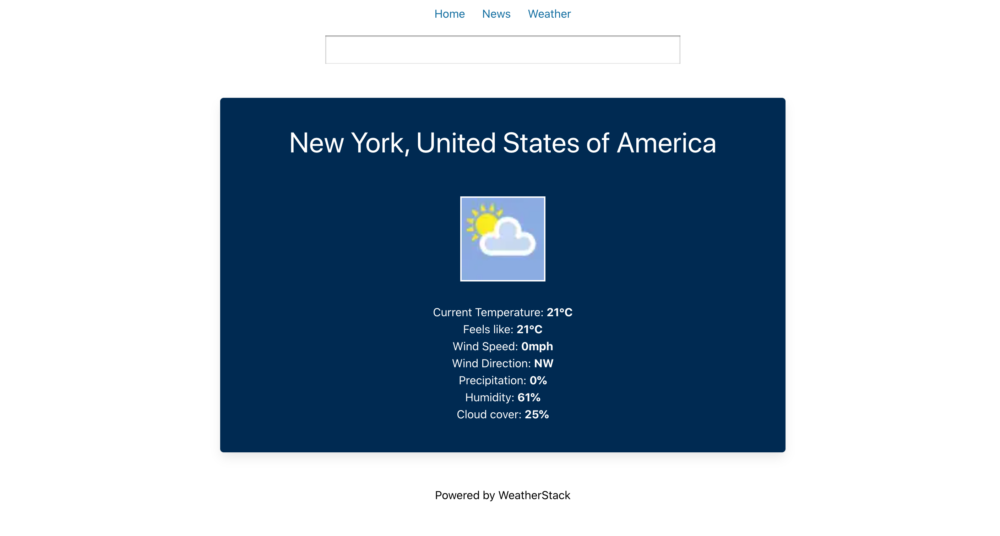

# ** SEI Project two: Reactathon**

## https://news-and-weather-worldwide.netlify.app/

## **Overview.**

Project 2 was my first experience pair coding. My self and my partner had to create a front end app using **React** and **Axios** to consume an **API** in under 2 days. We made the decision to build a News and Weather app with 2 seperate APIs both with rich data sources. 

Once built our app was deployed using **Netlify**

-------------------------
## **Brief.**

#### Project brief:

* **Consume a public API** – this could be anything but it must make sense for your project.
* **Have several components** - At least one classical and one functional.
* **The app can have a router** - with several "pages", this is up to your disgression and if it makes sense for your project.
* **Include wireframes** - that you designed before building the app.
* **Be deployed online** and accessible to the public.

-------------------------

## **Technologies used.**

#### Front End:
* **React**
* **Axios**
* Bulma
* SCSS
* React loader spinner
* React router dom

#### Dev Tools:

* Yarn
* VScode 
* Insomnia
* Git
* Github
* Google Chrome dev tools
* Eslint
* Netlify

-------------------------

## **Approach.**

#### APIs:

For our app we decided to use 2 seperate **APIs** to give a more well rounded experience. For both we followed the **documentation** on the *API's* website. We used **Yarn** to install the **Axios** dependancy to use our request and return responses in *JSON* rather than using fetch then having to convert to JSON. The structure of the *APIs* required us to pass arguements to our Axios requests to enable specific queries.

#### Components and general structure:

##### News:

The structure of the app was created using **React**. We used the *Browser Router, Switch and Route* from the **React-router-dom** package to lay out navigations paths for the app. Then using two seperate navigation we created a main nav bar and a sub nav bar available only under the news heading on the main nav bar.

This allowed us to build on our general headlines page and use the **NewsAPI**'s ability to take specific categories and add complexity to our app. 

In addition to specific news categories the **API** also offered a range of news in different countries (and languages). I used a *select element* to make a drop down to offer news from around the world. I then used **React's** onChange event handler to set the state then pass the user's selected value to the *Axios* request. This enabled our app to display for example the *Scince news* in *China* (as seen below).

#### Weather:

We followed a very similar journey setting up our Weather section. We used *event listeners* to listen for the user to input their town/city. onSubmit we passed the city to the *Axios* request then set state with the response. Once the state was set we were able to select the data we wanted to display from the API. Unfortunately, the free version of the *API* only allowed us to display the current weather and not future weather. So we made the most of the resources we were provided with. 

#### Design

In our pair we made the decision to make the styles minimalistic across the app due to the *APIs* we had picked. We used **Bulma** for our inital lay out. However, once we had all functionality working we began to deviate from *Bulma* and use **SCSS** to adapt our design. *Keyframes* were used to animate the home page. 

-------------------------

## **Bugs.**

Fortunately we havent noticed any bugs. We have had issues with the limitations of the *APIs* though. The limitations of the APIs require us to change API keys from time to time.  

-------------------------

## **Wins and Issues.**

#### Wins:

A big win was working as a team with my partner to create our Reactathon news app. In the brief time period we had to create the app we managed to use our selected APIs to make a functional and diverse app.

#### Hurdles:

One hurdle we encountered was adapting to use API's which use more complex queries in the url than API's we had learnt in class. We used console logs and *Insomnia* to work our way through as a team.  

------------------------