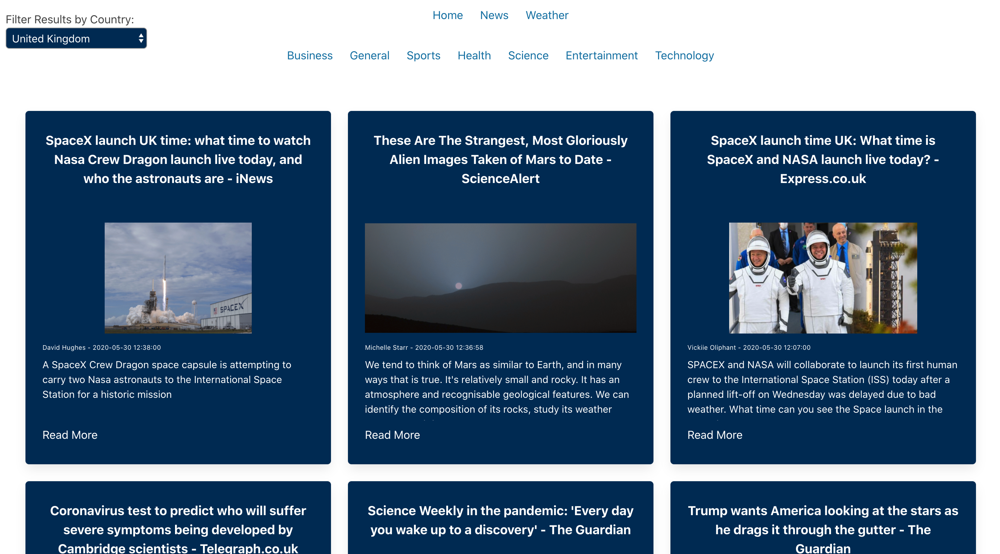

# **SEI Project two: Reactathon**

## https://news-and-weather-worldwide.netlify.app/

## **Overview.**

Project 2 was my first experience of pair coding. My partner and I had to create a front end app using **React** and **Axios** to consume an **API** in just over 1 day. We made the decision to build a News and Weather app with 2 seperate APIs both had rich resources.

Once built our app was deployed using **Netlify**.




-----------------------

## **To run this app.**

Due to the API being restricted on deployment to see this app in full you will have to clone the repository and run it on your own computer.

```yarn i```

```yarn start```

-----------------------

## **Brief.**

#### Project brief:

* **Consume a public API** – this could be anything but it must make sense for your project.
* **Have several components** - At least one classical and one functional.
* **The app can have a router** - with several "pages", this is up to your discretion and if it makes sense for your project.
* **Include wireframes** - that you designed before building the app.
* **Be deployed online** and accessible to the public.

-----------------------

## **Technologies used.**

#### Front End:
* **React**
* **Axios**
* Bulma
* SCSS
* React loader spinner
* React router dom

#### Dev Tools:

* Yarn
* VScode 
* Insomnia
* Git
* Github
* Google Chrome dev tools
* Eslint
* Netlify

-----------------------

## **Approach.**

#### APIs:

For our app we decided to use 2 seperate **APIs** to give a more well rounded experience. For both we followed the **documentation** on the *API's* website. We used **Yarn** to install the **Axios** dependency to use our request and return responses in *JSON* rather than using fetch then having to convert to JSON. The structure of the *APIs* required us to pass arguments to our Axios requests to enable specific queries.


#### News components and structure:

The structure of the app was created using **React**. We used the *Browser Router, Switch and Route* from the **React-router-dom** package to lay out navigation paths for the app. I created a main Nav bar and a sub-Navbar, available only under the news heading on the main nav bar. We also decided to exclude navbar and footer from the home page meaning we had to import it, when necessary, rather than putting it in the App.js before the *switch and routes*.


We used our sub-navbar to build on our main headlines page and use the **NewsAPI**'s ability to take specific categories and add complexity to our app. 

In addition to specific news categories the **API** also offered a range of news in different countries (and languages). I used a *select* to make a drop down to offer news from around the world. I then used **React's** *onChange* event handler to set the state then pass the user's selected value to the *Axios* request. This enabled our app to display, for example, the *Science news* in *China*. (as seen below)


#### Weather components and structure:

We followed a very similar journey setting up our **Weather section**. We used *event listeners* to wait for the user to input their City/Town. **onSubmit** we passed the City to the *Axios* request then set state with the response. Once the state was set we were able to select the data we wanted to display from the *API*. 

Unfortunately, the free version of the *API* only allowed us to display the current weather and not future weather. This was disappointing but we made the most of the resources we were provided with. 


#### Design:

We made the decision to make the style minimalistic across the app. We used **Bulma** for our initial lay out. However, once we had all functionality working we deviated from *Bulma* and used **SCSS** to adapt our design. *Keyframes* were used to animate the home page. 

-----------------------

## **Bugs.**

Fortunately we haven't noticed any bugs. We have had issues with the limitations of the *APIs* though, this can be remedied by changing the api keys from time to time on *netlify*.

-----------------------

## **Wins and Hurdles.**

#### Wins:

A big win was working as a team with my partner, Jakub, to create our *Reactathon News app*. In the brief time period we had to create the app we managed to use our selected APIs to make a functional and diverse app.

#### Hurdles:

One hurdle we encountered was adapting to use API's which use more complex queries in the url than API's we had learnt in class. We used console logs and *Insomnia* to work our way through as a team.  

-----------------------

## **Takeaways.**

This was my first opportunity to work as part of a team during the course. Jakub and myself communicated well and used **VS code's 'Live Share'** facility to *pair code* in addition to independent work on components agreed in our pair's stand up.

During this project I learnt to only use '*component did mount*' once calling a page setup function then reusing the page setup function to adapt the page when the state was altered. 

Another key takeaway from this project was getting comfortable with **AJAX** functionality in addition to error handling if the try statement failed. This was fortunate as the news API used in production stopped allowing our get requests once deployed. 

-----------------------